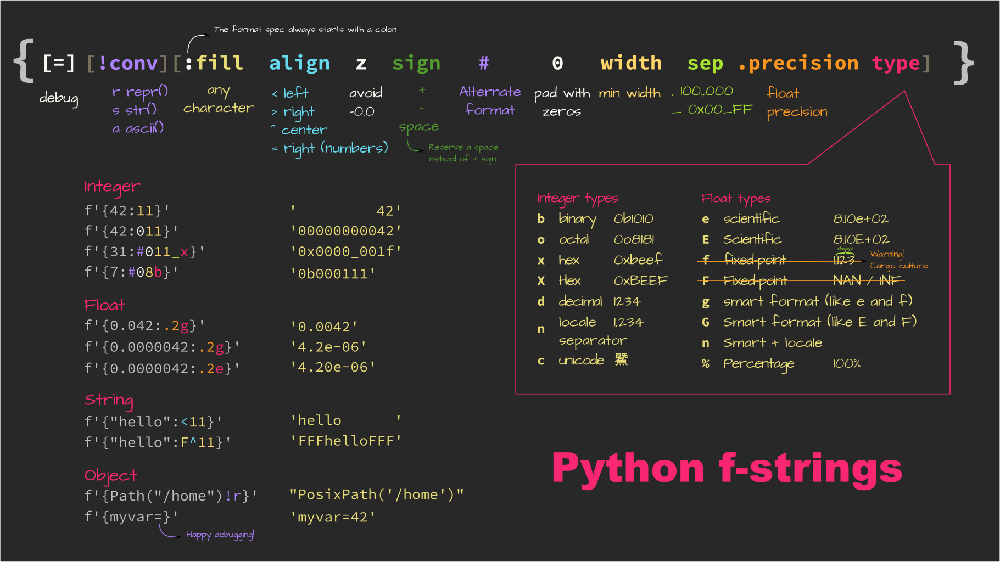

# Python f-strings



The image above is in SVG format, so it is infinitely scalable: zoom in at will!

Some further notes on Python f-strings:

1. Never use the `f` or `F` formats for floating point numbers. Use `g` instead.
   The problem is the `f` format fixes the number of digits after the decimal
   separator and that is most probably not what you want.

```python
>>> f'{0.00001234:.2f}'  # Gets converted to zero
0.00
>>> f'{0.00001234:.2g}'  # Does the right thing
'1.2e-05'
>>> f'{123456:.2f}'  # We get a pretty insane precision
'123456.00'
>>> f'{123456:.2g}'  # Does the right thing
'1.2e+05'
```